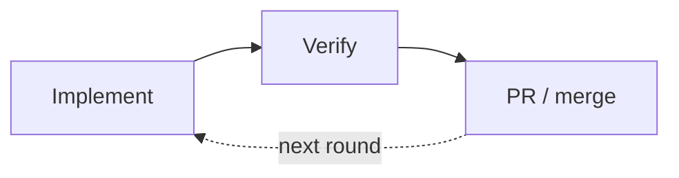
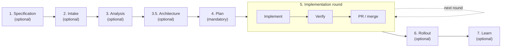
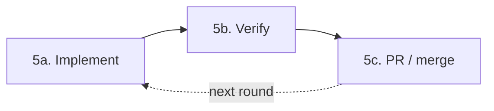
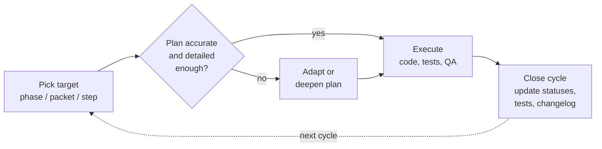

# MARSHAL — Process Documentation

**MARSHAL** = **M**ethod for **A**I-assisted **R**equirements Engineering, **S**oftware Implementation, with **H**uman **A**pproval and **A**daptive **L**earning.

This document defines MARSHAL, a practical AI-assisted SDLC for features, bugfixes, refactors, and technical debt work. It covers the full loop: framing a change, narrowing repo analysis, shaping an executable plan, implementing in reviewable slices, verifying, rolling out, and promoting durable learnings back into the system — all with explicit human approval gates between stages.

## Why this process exists

AI-assisted development can fail in a few predictable ways:
- broad repo search creates context pollution
- implementation starts before the change is framed correctly
- the plan drifts away from the code
- review feedback is handled ad hoc and never reflected back into the plan
- learnings are either lost or overfit to one case

This process avoids that by using:
- explicit intake
- focused (context-minimizing) code analysis
- structured planning
- controlled execution
- explicit verification
- release discipline
- curated learning

Many complex SDLC processes already exist. This document does not try to invent another one — it gathers common-sense practices I have been using, usually in parts, learned across multiple projects and from studying multiple frameworks. Its purpose is to make this common-sense process easier to follow stage by stage, and to automate knowledge learning over time.

## Core principles

- One canonical flow: every phase produces explicit artifacts (durable context) that feed the next phase.
- Keep the plan as the source of truth. Agent “plan mode” is only a helper, never the canonical plan.
- Default to small, reviewable slices; use larger PRs only at integration boundaries.
- Replanning is mandatory whenever assumptions change, but only at the affected level.
- Every phase emits:
  - a **change log**
  - a **learning file**
- Learning files contain only **generalizable lessons**:
  - changes to rules
  - flow improvements
  - skill updates
  - agent instruction updates
  - reusable testing/review patterns
  - recurring repo conventions
- Learning files must **not** be polluted with case-specific details

## 5. Learning model

Each phase produces a learning file.

The learning file is **not** a narrative diary.
It is a curated list of reusable, general lessons.

Allowed:
- “For this repo, tracing request flow should start at handlers, not controllers.”
- “For schema-affecting changes, rollout notes must always include rollback data handling.”
- “Use L4 implementation detail only when shared contracts are involved.”

Not allowed:
- case-specific bug details that do not generalize
- one-off code specifics
- transient observations with no reuse value

At the end of the change, phase learnings are merged into a `learning-rollup.md`.
That rollup is reviewed and optionally promoted into:
- `AGENTS.md`
- skill files
- rules docs
- test strategy docs
- team checklists
- reusable prompts
- memory/knowledge files

Promotion rule:
- promote only recurring or clearly reusable guidance

## What this process borrows from

This process adapts several established ideas into one practical operating model:

- **Shape Up**:
  - shaping before building
  - bounded scopes/slices
  - explicit tradeoffs around what belongs in a delivery slice

- **lightweight ADR / RFC practice**:
  - only write decision records for decisions that matter
  - keep them concise and close to the code

- **trunk-based and small-batch delivery**:
  - integrate frequently
  - keep merge boundaries meaningful
  - do not over-fragment review into tiny PRs

- **testing strategy biased toward confidence**:
  - use unit tests where logic density is high
  - use integration tests where behavior confidence matters most
  - add E2E only where the risk justifies it

- **blameless learning/postmortem culture**:
  - capture what should change in the system/process
  - avoid storing blame or one-off details as long-term rules

- **modern agent workflow guidance**:
  - keep one canonical process
  - use planning features as helpers, not as the source of truth
  - parallelize only when decomposition is real and safe

---

# Concept model

---

## Canonical artifact chain

Every change should move through this chain:

**Specification → Change Brief → Analysis, Repo Recon → Architecture Notes (optional) → Delivery Plan → Implementation + Phase Logs + Phase Learnings → Verification Report → Rollout Note → Learning Rollup**

Each artifact becomes input to the next phase.

---

## Plan hierarchy

MARSHAL defines up to 4 planning levels. **Use only as many as the change
needs.** A trivial fix may be a single phase with one step (no L2/L3/L4
at all). A larger change may go all the way to L4 in places. The agent
plans down to whatever depth genuinely helps the next implementation
cycle — unless the user has explicitly pinned a target depth, in which
case that pin is honored.

### L1 — Phase / Slice
A coherent slice of work that is reviewable as a larger chunk and may map to one PR. One PR might also span multiple phases / slices.

Contains:
- goal
- scope / non-goals
- dependencies
- rollout boundary
- review boundary
- optional parallel tag(s): `<~T1>`, `<~T2>`

### L2 — Work Packet
A reviewable internal packet inside a phase. Normally discussed directly with the AI and user, not as its own PR. A work packet would usually consist of one or multiple commits. However, a commit is **not** a planning level.

Contains:
- objective
- acceptance criteria
- touched components
- risks / unknowns
- test intent
- status

### L3 — Steps / Substeps
Execution-oriented decomposition of a work packet.

Contains:
- ordered steps
- optional parallel tags
- dependencies between steps
- done criteria

### L4 — Implementation Steps
Optional rough technical design detail.

Use only when useful:
- class/module/service changes
- method/function/API changes
- schema/migration details
- event/queue/topic changes
- config/flag wiring
- rough interfaces and contracts

### Choosing the right depth

- **Always have at least L1** for the whole change so the overall
  shape is agreed (a single phase counts).
- **Stop deepening when going further wouldn't change behavior in
  the next implementation cycle.** Trivial work may legitimately
  stop at L1 + a one-line objective.
- **Go to L3 / L4** when the work is risky, cross-cutting, public-
  interface, migration, concurrency, or security-sensitive — or when
  the user asks for it.
- **Per-area depth is fine.** One phase may live at L2 while another
  goes to L4.
- **The user pins.** If the user specifies a target depth ("plan only
  to L2", "go to L4 for the auth work"), follow it. Otherwise the
  agent picks pragmatically and surfaces the choice for approval.
- Not every level has to be filled in up front — see "Staged planning"
  in stage 4.

## Plan status markers

Use simple inline markers:

- `[TODO]`
- `[IN PROGRESS]`
- `[DONE]`
- `[BLOCKED]`
- `[DROPPED]`
- `[ADDED yyyy-mm-dd]`
- `[CHANGED yyyy-mm-dd]`
- `[FIXUP yyyy-mm-dd]`
- `[REVERT yyyy-mm-dd]`

## 4. Parallelism

Parallel work is optional and should be marked only when useful. For parallelizable items, append optional thread markers:
- `<~T1>`
- `<~T2>`
- `<~T3>`

Rules:
- same-level items with the same thread tag may run in parallel if dependencies allow
- if parallel work touches the same files/contracts, mark it as `shared-surface`
- do not force parallelism where coordination cost is higher than the gain
- parallel tags are optional, not mandatory
- parallelism should happen mainly at:
  - phase level
  - work packet level
  - occasionally step level

## Implementation round and implementation cycles

Two cycle scales exist inside the lifecycle — the big one groups three high-level stages that can repeat for parts of the plan, the small one drives the Implement stage itself.

### Implementation round (big)

Stages 5a Implement, 5b Verify, and 5c PR / merge are still three separate high-level stages, but they run together as one **implementation round**. A round can run:
- **once** for the whole change — one Implement, one Verify, one PR at the end
- **per phase / slice** — each phase is implemented, verified, and merged before the next begins
- occasionally **per work packet or small group of packets**, when a coherent, testable delta warrants its own integration boundary

Rule: **every PR must be preceded by a Verify stage for its content**. Verification is never skipped before merge.

### Implementation cycle (small)

Inside the Implement stage, work itself runs in smaller **implementation cycles** — pick a target (phase / packet / step), execute it, close the cycle. A round contains one or more cycles (see "Implementation cycles" in stage 5).

## Specification change

A specification change may happen at any time. When it does:
- amend `change-brief.md` with the new or changed requirement
- re-run Analysis, narrowed to the affected surface, and update `repo-recon.md`
- update `delivery-plan.md`:
  - keep already-finalized work as `[DONE]` where it remains valid
  - add new phases/packets/steps for new requirements, marked `[ADDED yyyy-mm-dd]`
  - add explicit items for work that must be undone, marked `[REVERT yyyy-mm-dd]`
  - mark anything no longer needed `[DROPPED yyyy-mm-dd]`

## Lifecycle - stages

### Terminology

Individual lifecycle steps will be referred to as **stages**, as opposed to phases/slices, work packets, steps, substeps, implementation steps (which are elements of the implementation plan)

### Overview

Stages **5a Implement**, **5b Verify**, and **5c PR / merge** together form one **implementation round** (see the Concept model). The dotted self-loop shows that the round may repeat — once for the whole change, or per phase/slice.

### Stage optionality

MARSHAL is meant to scale with the size of the change. Only **stage 4 Plan** is mandatory — `delivery-plan.md` is the canonical source of truth for the change and must always exist. Every other stage is optional and may be skipped when it would not add value. Practical guidance:

- **Trivial changes** (typo, one-line config, obvious patch): produce a minimal one-section plan, implement, and stop. Skip Specification, Intake, Analysis, Architecture, Verify-as-separate-stage, Rollout, and Learn.
- **Small but non-trivial changes** (a focused bugfix or a small feature): a short plan plus an Implement+Verify round is usually enough. Specification / Intake / Analysis can be folded into the plan's framing section if separate artifacts are not justified.
- **Larger or risky changes**: keep the full pipeline. Architecture is recommended whenever the shape of the solution is not obvious.
- **Always required regardless of size**: any PR must still be preceded by Verify for its content (see stage 5b).

If a stage is skipped, do not invent its artifact. The downstream skill that would have consumed it must be able to proceed without it (its `Inputs` section says which artifacts are optional). The chosen scope (which stages are run, which are skipped) should be agreed with the user up front and recorded as the first lines of `delivery-plan.md`.

## 1. Specification / clarify (optional)

### Goal
Turn the user's raw prompt into an explicit, agreed specification before any framing or repo work begins.

### When to skip
For trivial changes, or when the user's prompt is already unambiguous and self-contained. The clarifications can also be folded into stage 2 Intake when both stages would be light.

### What happens here
- The user provides a prompt (feature idea, bug, refactor, tech-debt note).
- The agent works **with** the user to clarify the request.
- The agent **does not assume**. Where the prompt is ambiguous, incomplete, or contradictory, the agent lists the open points and asks targeted questions before proceeding.
- The agent flags problems, risks, or disagreements explicitly and discusses them with the user rather than silently working around them.
- An optional **acceptance checklist** is produced when it is useful for the change at hand.
- Specification is approved by the user before moving on.

### Exit criteria
- the request is captured in the user's words plus any agreed clarifications
- ambiguities are explicitly listed and either resolved or accepted as open
- agent objections / risks are recorded with the user's response
- specification is approved by the user

### Artifacts produced
- `specification.md`
    Include:
    - the original user prompt (verbatim)
    - clarified intent (the agreed restatement)
    - explicit assumptions, marked as such
    - open questions still unresolved (if any)
    - agent concerns / disagreements raised, and how they were resolved
    - optional acceptance checklist (the conditions the user expects to see satisfied)
- `logs/phase-1.changelog.md`
    Record:
    - questions asked and answers received
    - clarifications added
    - assumptions promoted to agreed facts
    - agent concerns raised and outcomes
- `learning/phase-1.learning.md`
    Record only reusable learnings, e.g.:
    - “Always ask about target environment before clarifying scope”
    - “For bug reports, require expected vs actual upfront”

### Skill
- [`marshal-specify`](marshal-files/skills/marshal-specify/SKILL.md)

---

## 2. Intake / framing (optional)

### Goal
Turn the approved specification into a crisp, testable framing for engineering before repo analysis begins.

### When to skip
For trivial changes; or when the specification already contains scope, acceptance criteria, and constraints in enough detail to plan against directly.

### Inputs
- `specification.md` from stage 1 (if produced)

### What happens here
For a feature:
- define the user/problem outcome
- define scope and non-goals
- define acceptance criteria
- define technical/operational constraints
- define rollout expectations

For a bugfix:
- capture repro steps
- define expected vs actual
- define impact/blast radius
- collect evidence
- capture suspected areas if known

### Exit criteria
- goal is explicit
- scope/non-goals are explicit
- acceptance criteria are explicit
- constraints and rollout expectations are explicit

### Artifacts produced
- `change-brief.md`:
    For a feature:
    - problem / user outcome
    - scope / non-goals
    - acceptance criteria
    - constraints
    - rollout expectations
    For a bugfix:
    - repro steps
    - expected vs actual
    - impact / severity
    - evidence
    - suspected area if known
- `logs/phase-2.changelog.md`
    Record:
    - clarifications added
    - scope changes
    - acceptance criteria changes
- `learning/phase-2.learning.md`
    Record only reusable learnings, e.g.:
    - “Require explicit repro template for bugfix intake”
    - “Always capture rollout expectation for externally visible changes”

---

## 3. Research / analysis (optional)

### Goal
Understand the requirement and narrow the repo search surface before planning.

### When to skip
For changes whose surface is already known (e.g. a single file or component the user named). Knowledge from `.marshal/knowledge/` may also make a separate recon redundant for well-mapped areas.

### What happens here
- identify likely bounded context / subsystem
- identify likely files / classes / services / tables / APIs
- capture invariants and contracts
- locate existing tests and test seams
- identify unknowns / risks
- explicitly exclude irrelevant areas to avoid context pollution

### Exit criteria
- likely change surface is identified
- key invariants/contracts are captured
- unknowns are explicit
- planning can proceed without broad repo search

### Artifacts produced
- `repo-recon.md`
    Include:
    - likely bounded context / subsystem
    - likely files / classes / services / tables / APIs
    - invariants and contracts
    - existing tests and test seams
    - unknowns / risks
    - excluded areas to avoid context pollution
- `logs/phase-3.changelog.md`
    Record:
    - files inspected
    - architecture notes added
    - assumptions confirmed / rejected
    - narrowed search surface
- `learning/phase-3.learning.md`
    Record only generalized learnings, e.g.:
    - “In this repo, handlers are better entry points than controllers for tracing flow”
    - “Always inspect feature-flag definitions before planning cross-module changes”

---

## 3.5. Architecture / design (optional)

### Goal
Agree on a general implementation concept before planning.

### When to use
Optional. Advised for larger or less-obvious topics. Skip when the shape of the solution is already clear.

### What happens here
- the human proposes a design / architecture, or asks the AI to propose one
- the concept can be defined at any abstraction level, or at multiple levels (e.g. high-level components, module layout, APIs / schemas), depending on the case
- design decisions are discussed and captured as they are made

Inputs:
- `change-brief.md`
- `repo-recon.md`
- general knowledge of the repository

### Exit criteria
- the chosen implementation concept is documented
- key design decisions are captured

### Artifacts produced
- `architecture-notes.md`
    Free-text notes describing:
    - the chosen implementation concept
    - design decisions made and their rationale
    - abstraction level(s) covered
- `logs/phase-architecture.changelog.md`
    Record:
    - concepts proposed / rejected / accepted
    - design changes
- `learning/phase-architecture.learning.md`
    Record only reusable learnings.

---

## 4. Plan / shape (mandatory)

### Goal
Convert the brief + recon (or, for lightweight runs, the prompt itself) into an executable, reviewable plan.

### Why mandatory
`delivery-plan.md` is the canonical source of truth for the change. Every change — even a one-line fix — has a plan, even if that plan is a single phase with a single step. Implementation never proceeds without it.

### What happens here
- agree on initial planning depth — both the **target depth** (do we
  plan to L1, L2, L3, or L4? possibly different per area) and the
  **timing mode** (full vs. staged vs. mixed; see below)
- define phases/slices
- define work packets only where the agreed depth includes L2
- define execution steps only where the agreed depth includes L3
- add L4 implementation detail only where it pays off (or where the
  user asked for it)
- mark review boundaries
- mark PR boundaries
- mark rollout boundaries
- mark safe parallelism using `<~Tn>` if helpful

### Exit criteria
- plan is approved to the agreed depth (which may stop above L4 — or
  even above L2/L3 — for simple work)
- review boundaries are explicit
- PR boundaries are explicit
- parallelizable items are marked where useful
- depth-per-area, if non-uniform, is recorded so the implementer
  knows where to expect detail and where to use judgment

### Required artifacts
- `delivery-plan.md`
    Suggested structure:

    # Delivery Plan

    Planning mode: full | staged | mixed
    Target depth: L1 / L2 / L3 / L4 (per area, e.g. "L2 default; L4 in P1")

    ## P1. Phase / Slice title `[TODO]` `<~T1>`
    Goal:
    Dependencies:
    Review boundary:
    PR boundary:
    Rollout boundary:

    ### W1. Work Packet title `[TODO]`
    Objective:
    Acceptance criteria:
    Touched components:
    Risks / unknowns:
    Test intent:

    #### S1. Step `[TODO]`
    - substep
    - substep

    ##### I1. Implementation step (optional)
    - module/class changes
    - method/function changes
    - API/schema changes

    #### S2. Step `[TODO]`

    ### W2. Work Packet title `[TODO]` `<~T2>`

    ## P2. Phase / Slice title `[TODO]`

- `logs/phase-4.changelog.md`
    Record:
    - plan additions/removals
    - packet splits/merges
    - dependency changes
    - review boundary changes
    - PR boundary changes

- `learning/phase-4.learning.md`
    Record only reusable learnings, e.g.:
    - “For medium changes, define PR boundary at phase level, not packet level”
    - “Use L4 implementation steps only for shared interfaces and migrations”
    - “Use staged planning when later phases depend on decisions made in earlier ones”
    - “For this area, detailed plans below L2 tend to churn — plan L3/L4 just in time”

### Staged planning

Planning has two independent dials:

1. **Target depth** — how far down (L1 / L2 / L3 / L4) the plan goes.
   May vary per area. Default: agent picks the shallowest depth that
   still makes the next implementation cycle unambiguous; user may
   pin a different depth.
2. **Timing mode** — when the planned levels are filled in.

Timing modes:
- **Full plan up front** — everything at the chosen target depth is
  planned before implementation starts. Good default for small or
  well-understood changes.
- **Staged / rolling plan** — higher levels are planned up front;
  lower levels are filled in just in time, phase by phase (or packet
  by packet). Good for larger or less-certain work where deeper
  details would likely churn.
- **Mixed** — rough plan for the whole story plus a detailed plan for
  the first phase(s). The rest is deepened as earlier phases finish.

Rules:
- The initial plan must always cover L1 for the whole change, so the overall shape is agreed.
- Each phase/packet must be planned to the depth needed for its implementation cycle(s) **before** that cycle starts. No item is implemented without its own plan complete to the required depth.
- Deepening is a normal, expected update — not a replan. Log it to the phase changelog, but do not treat it as a scope change.
- If deepening reveals that higher-level assumptions were wrong, fall back to the Replanning rule.
- The chosen target depth (per area, if non-uniform) and timing mode
  are captured once in `delivery-plan.md`; subsequent deepening passes
  are logged to the relevant phase changelog.

### Replanning rule

Replan when:
- scope changes
- root cause changes
- hidden dependency appears
- tests reveal missing work
- review requests structural change
- rollout or migration risk changes

Replanning scope:
- patch only the affected packet/phase unless the impact propagates

Replanning mechanics:
- update `delivery-plan.md`
- mark changed items
- append rationale to changelog
- add only generalized reusable insights to learning file

---

## 5. Implementation round: Implement, Verify, PR

Three high-level stages — **Implement**, **Verify**, and **PR / integration / merge** — run together as one **implementation round**. They remain distinct stages, but are bundled here because they always flow together and may repeat for parts of the plan (once for the whole change, or per phase / slice).

Rule: **every PR must be preceded by a Verify stage for its content**. Verification is never skipped before merge.

Inside the Implement stage, work runs in smaller **implementation cycles** (see below). PR grouping defaults are in the PR subsection.

---

### 5a. Implement

#### Goal
Execute the approved plan.

#### Implementation cycles
The Implement stage runs in small **implementation cycles**. The human chooses the granularity of each cycle: a phase/slice, a work packet, or a step/substep.

A cycle roughly follows these steps: pick the target, confirm the plan is still accurate **and detailed enough for this target — deepen it if staged planning left this item at a higher level**, execute, review, close the cycle (update statuses, changelog, tests). Use this as a guide, not a rigid checklist.

Within a cycle the human can:
- ask the AI to implement plan items
- ask the AI for a custom programming task outside the current plan item
- write code themselves and discuss with the AI
- ask for a review at any time

If the plan has to be adapted at any point during implementation, do it explicitly in `delivery-plan.md` before continuing. Very small changes or extensions don't need a plan update.

Implementation cycles are nested inside the **implementation round** (Implement → Verify → PR). See the Concept model.

#### Testing strategy
Testing is part of each cycle, not a separate end step. For each cycle:
- cover new or changed code primarily with **unit tests**, adding **integration tests** for general cases and cross-component behavior, following the conventions defined for the repo
- when applicable, run real-life tests — the AI should run the code, the application, and full-stack / UI flows whenever possible
- the human should manually test partial results when it makes sense (e.g. UX, or environments the AI cannot reach)

The final, formal checks — requirements validation, code testing guidance, and Dev-QA — happen in the Verify subsection below.

#### Rules
- implement against the current approved plan only
- update status markers live
- keep diffs small enough to reason about
- a work packet is an execution unit, not a PR unit
- a commit is not a planning unit

#### Review model

Default:
- user reviews **within the plan** and in direct discussion with the AI at work-packet/task level
- PR review is used for a **larger integration boundary**:
  - whole phase or the full approved slice or multiple phases / slices
  - in special cases, a work packet or multiple packets

Therefore:
- **work packets are usually reviewed conversationally**
- **internal review often happens below PR level**
- **PRs are usually phase-level / slice-level or scope multiple phases / slices or the whole implementation**

PRs should normally be assigned to another human developer for review, but can alternatively / additionally be reviewed by a reviewing AI agent.

#### If changes are requested during review

Do not edit silently.

Update the plan in `delivery-plan.md` using one of these patterns:

##### Small correction inside same packet
- add a new step/substep under the current work packet
- mark it `[ADDED yyyy-mm-dd]` or `[FIXUP yyyy-mm-dd]`

##### Correction that changes scope/approach
- mark affected packet `[CHANGED yyyy-mm-dd]`
- update remaining steps below it
- update dependencies if needed

##### Correction that deserves isolation
- create a new sibling work packet:
  - `W1a. Review fixups [ADDED yyyy-mm-dd]`

Always log:
- why the correction was needed
- what changed in plan structure
- whether already-completed work remains valid

#### Exit criteria for a work packet
- acceptance criteria met
- plan status updated
- tests updated
- changelog updated

#### Artifacts produced
- `logs/phase-N.changelog.md`
    For each implementation phase, record:
    - steps completed
    - code areas changed
    - tests added/updated
    - review feedback received
    - fixups applied
    - commits/branches/PR references if used

- `learning/phase-N.learning.md`
  Record only reusable learnings, e.g.:
  - “For this repo, integration tests should be added before refactor on shared services”
  - “Review quality improved when packet descriptions included touched contracts explicitly”
  - “Parallel work on adjacent modules still conflicted because config wiring was shared”

- `delivery-plan.md`
    Update statuses in the delivery plan

---

### 5b. Verify

#### Goal
Run an explicit verification gate, separate from coding. Re-run the Implement stage in case of failed verification.

#### When to scale down
For trivial changes, Verify can collapse into a short paragraph in the phase changelog rather than a separate `verification-report.md`. The Verify rule still holds: nothing merges without an explicit verification step recorded somewhere.

#### Requirements validation
The AI agent goes through every requirement in `change-brief.md` and verifies:
- each requirement is implemented
- all corner cases are covered
- possible error cases are handled

The outcome is part of the acceptance criteria check.

#### Code testing guidance
Guidance for automated code tests:
- for bugfixes: reproduce first, then add a regression test where possible
- prefer unit tests as the primary coverage
- use integration tests for general cases and cross-component behavior
- add E2E only for critical user journeys or release risk

#### Dev-QA
Beyond automated code tests, explicit QA is part of verification. Basic / happy case testing and some corner case testing should always happen:
- the AI agent should perform QA whenever possible (by running the code or the application)
- the human developer should always also perform QA manually before sending a PR for review
- the human should always do manual testing of the end solution

The outcome is part of the acceptance criteria check.

#### Exit criteria
- verification passed
- any required replan/fixup is added back into the plan, and the Implement stage is run again

#### Required artifacts
- `verification-report.md`
    For each completed round / PR boundary:
    - acceptance criteria check, including requirements validation (by AI) and dev-QA (happy-case and corner-case testing, by AI and by human)
    - static analysis / lint / typecheck
    - unit tests
    - integration tests
    - migration checks
    - observability/logging checks
    - security/privacy checks if relevant
    - open issues / residual risks

- append results to `logs/phase-N.changelog.md`
    Append:
    - verification result
    - defects found
    - rework triggered
    - final status

- append reusable lessons to `learning/phase-N.learning.md`
    Record only reusable learnings, e.g.:
    - “Bugfix flow should require regression test before final verification when reproducible”
    - “Shared fixtures created false positives; add rule to isolate integration fixtures”

---

### 5c. PR / integration / merge

#### Goal
Use PRs only at meaningful integration boundaries.

#### When to skip
For work that is not committed to a shared branch (local experiments, scratch work) or for trunk-direct workflows where the merge boundary is implicit. The Verify rule still applies before any code is shared with others.

#### Recommended default
- one PR per whole implementation (all phases/slices)
- one PR per phase/slice
- in special cases, one PR per group of completed work packets that forms a coherent, testable delta

#### Avoid
- one PR per tiny packet
- one PR per commit

#### PR should include
- linked phase(s) / packet(s)
- change summary
- test summary
- rollout note
- known limitations
- follow-up packets if any

#### If PR review requests changes
- changes must be reflected back into `delivery-plan.md`
- mark affected items `[FIXUP]` / `[CHANGED]` / `[ADDED]`
- append rationale to the phase changelog

---

## 6. Release / rollout (optional)

### When to skip
For changes with no operational impact — internal refactors, doc-only changes, or work behind a flag that does not yet ship. Skip whenever there is nothing to migrate, toggle, document for users, or roll back.

### Exit criteria
- relevant migrations are documented
- list of basic manual test scenarios to be run is generated
- release notes are logged

### Artifacts produced
- `rollout-note.md`
    Include:
    - introduced toggles, properties
    - log categories added/removed
    - porting instructions if necessary (for patches)
    - necessary migrations
    - rollback path
    - user-visible docs changes if needed or any other information that needs to be documented

- `logs/phase-rollout.changelog.md`
    Record 
    - additions/changes to the rollout note

- `learning/phase-release.learning.md`
    Record only reusable learnings, e.g.:
    - “Cross-service changes require rollout notes even for internal features”
    - “Always document rollback for schema-affecting changes”

---

## 7. Learn / improve the system (optional)

### Goal
Promote generalized learnings into durable system guidance. The user should approve the final update before merging the final update lists to individual buckets.

### When to skip
When no phase produced a learning file worth promoting (small or routine changes). Skipping Learn does **not** delete the per-phase learning files; they remain available for a later rollup.

### Inputs
- all `learning/phase-*.learning.md` files

### Promotion targets
- `AGENTS.md`
- custom skill files
- rules / conventions docs
- reusable prompts
- checklists
- test templates
- architecture guidance
- memory/knowledge files

### Promotion rules
- keep only recurring, reusable guidance
- reject one-off case details
- prefer rule changes only when the signal is strong
- every promoted learning should be phrased as a reusable instruction or heuristic

### Output
- `learning-rollup.md`
  Merge and deduplicate, filter only high-value general learnings.

#### Buckets
- AGENTS updates
- README updates
- rules updates
  - coding standard updates
  - test strategy updates
  - repo navigation heuristics
- skill file updates, including review/plan convention updates

//TODO each lifecycle stage should be validated by the user, discussed if necessary, only then we can proceed to the next phase — that selection should be recorded in the plan (the "scope" line set during stage 4).

---

---

## Skills and subagents

MARSHAL ships a set of `marshal-*` skills (one per stage plus knowledge skills) and a set of `marshal-*` subagent definitions under [`.marshal/`](marshal-files/). Skills hold the procedural detail; agents are thin wrappers that compose skills with the necessary handoffs and run with isolated context.

Skills (per stage):

| Stage | Skill | Artifact | Optional? |
|---|---|---|---|
| 1. Specification | [`marshal-specify`](marshal-files/skills/marshal-specify/SKILL.md) | `specification.md` | optional |
| 2. Intake | [`marshal-intake`](marshal-files/skills/marshal-intake/SKILL.md) | `change-brief.md` | optional |
| 3. Analysis | [`marshal-analysis`](marshal-files/skills/marshal-analysis/SKILL.md) | `repo-recon.md` | optional |
| 3.5. Architecture | [`marshal-architecture`](marshal-files/skills/marshal-architecture/SKILL.md) | `architecture-notes.md` | optional |
| 4. Plan | [`marshal-plan`](marshal-files/skills/marshal-plan/SKILL.md) | `delivery-plan.md` | **mandatory** |
| 5a. Implement | [`marshal-implement`](marshal-files/skills/marshal-implement/SKILL.md) | code + phase logs | mandatory when there is code to write |
| 5b. Verify | [`marshal-verify`](marshal-files/skills/marshal-verify/SKILL.md) | `verification-report.md` | mandatory before any PR; may be folded into the changelog for trivial changes |
| 5c. PR | [`marshal-pr`](marshal-files/skills/marshal-pr/SKILL.md) | PR description | optional (skip for non-shared work) |
| 6. Rollout | [`marshal-rollout`](marshal-files/skills/marshal-rollout/SKILL.md) | `rollout-note.md` | optional |
| 7. Learn | [`marshal-learn`](marshal-files/skills/marshal-learn/SKILL.md) | `learning-rollup.md` | optional |

Setup skills:
- [`marshal-init`](marshal-files/skills/marshal-init/SKILL.md) — first-time MARSHAL setup in a repo: scaffolds `.marshal/`, optionally installs [ai-dev-agent-config-sync](https://github.com/crestreach/ai-dev-agent-config-sync) (e.g. as a submodule), provisions an `agent-config/` source tree, runs [`marshal-promote-assets`](marshal-files/skills/marshal-promote-assets/SKILL.md) to wire MARSHAL durable assets into it, and (optionally) runs the sync to fan everything out into tool-native layouts.
- [`marshal-load`](marshal-files/skills/marshal-load/SKILL.md) — session bootstrap.
- [`marshal-help`](marshal-files/skills/marshal-help/SKILL.md) — on-demand expert on MARSHAL: answers procedural and conceptual questions, orients the caller in the current change, and hands off to the right stage skill or to `marshal-driver` when work needs to actually progress.
- [`marshal-promote-assets`](marshal-files/skills/marshal-promote-assets/SKILL.md) — copy MARSHAL durable assets from `.marshal/{skills,agents,rules}/` into the repo's `agent-config/` source tree (with `mx_` prefix) so the next `agent-conf-sync` run fans them out to all tool layouts.

Knowledge skills (see Memory & Knowledge):
- [`marshal-knowledge-init`](marshal-files/skills/marshal-knowledge-init/SKILL.md)
- [`marshal-knowledge-maintain`](marshal-files/skills/marshal-knowledge-maintain/SKILL.md) (modes: `from-changes`, `from-learning`, `rescan`)
- [`marshal-knowledge-research`](marshal-files/skills/marshal-knowledge-research/SKILL.md)
- [`marshal-knowledge-branch-merge`](marshal-files/skills/marshal-knowledge-branch-merge/SKILL.md)
- [`marshal-knowledge-rebuild`](marshal-files/skills/marshal-knowledge-rebuild/SKILL.md)

Subagents (orchestration / fresh-context wrappers — v2):
- [`marshal-driver`](marshal-files/agents/marshal-driver.md) — process orchestrator across stages.
- [`marshal-helper`](marshal-files/agents/marshal-helper.md) — fresh-context MARSHAL coach: wraps `marshal-help` to answer questions about the process, the knowledge layer, and how MARSHAL applies to the current change.
- [`marshal-researcher`](marshal-files/agents/marshal-researcher.md) — fresh-context research.
- [`marshal-knowledge-curator`](marshal-files/agents/marshal-knowledge-curator.md) — fresh-context knowledge maintenance.
- [`marshal-code-archaeologist`](marshal-files/agents/marshal-code-archaeologist.md) — fresh-context analysis (stage 3).
- [`marshal-planner`](marshal-files/agents/marshal-planner.md) — fresh-context planning (stage 4).
- [`marshal-reviewer`](marshal-files/agents/marshal-reviewer.md) — AI review at stage 5c.

Every skill states its own prerequisites, inputs, outputs, and handoff (next skill + artifacts to pass). That makes each skill safe to run in an isolated context.

---

## Memory and knowledge

MARSHAL is paired with an agent-managed knowledge layer kept under [`.marshal/knowledge/`](marshal-files/knowledge/). Knowledge complements the per-change artifact chain: the artifact chain captures *this* change, while knowledge captures durable facts about the repo (architecture, logic, conventions, decisions) that survive across changes.

Key points:

- **Two trees.** The `.marshal/` config-sync source ships marshal-* agents/skills/rules and gets fanned out to tool layouts. The `.marshal/knowledge/` tree is **not synced** — agents read it directly through [`.marshal/ENTRYPOINT.md`](marshal-files/ENTRYPOINT.md).
- **Progressive disclosure, recursive.** Always-loaded root [`INDEX.md`](marshal-files/knowledge/INDEX.md) (capped at `knowledge.root_index_max_lines`) → per-folder indexes → topic files. Topics may themselves split into a sub-index plus subtopics, recursively, with no fixed depth.
- **Configurable size limits.** [`config.yml`](marshal-files/config.yml) defines `knowledge.topic_max_lines` (default 400) and `knowledge.subindex_max_lines` (default 150). When a topic exceeds its cap, `marshal-knowledge-maintain` proposes a split: convert the topic into a folder with a sub-index and subtopic files. The split dimension (by component, by concern, by time, by feature, etc.) is chosen for each topic; reviewers may re-split along a different dimension during a knowledge review.
- **Frontmatter contract.** Every knowledge file has `id`, `kind`, `summary`, `repo_paths`, `importance`, `confidence`, `updated`, `verified_against_commit`. See [`references/knowledge-format.md`](marshal-files/references/knowledge-format.md).
- **Staleness without hooks.** `verified_against_commit` + `updated` are stamped explicitly. The maintenance skill diffs HEAD against the recorded SHA on demand.
- **Approval.** [`.marshal/config.yml`](marshal-files/config.yml) controls autonomy (`review` default; `auto` opt-in). Knowledge writes produce a diff for human approval unless `auto` is set.
- **Where it plugs into the lifecycle.** Stage 3 (Analysis) consults knowledge first to narrow the search surface and may invoke `marshal-knowledge-research`. After each implementation cycle, `marshal-knowledge-maintain` mode `from-changes` keeps knowledge in sync. Stage 7 (Learn) feeds promotable items into knowledge via mode `from-learning`. Larger reconciliation is handled by `marshal-knowledge-branch-merge` and `marshal-knowledge-rebuild`.

Full design rationale: [`.marshal/design/knowledge-design.md`](marshal-files/design/knowledge-design.md). A worked example tree lives under [`examples/snippets-api/`](examples/snippets-api/).

---

## Generated assets and config sync

MARSHAL produces two kinds of content:

1. **Per-change artifacts** — specification, brief, recon, plan, logs, learnings, etc. They live in the per-change working folder.
2. **Durable assets** — skills, subagents, rules, and guidelines that codify reusable behavior. They live under [`.marshal/`](marshal-files/) and are versioned with the repo.

> **Naming note.** In a consumer repo, the durable-assets directory is `.marshal/`. In this product repo (the MARSHAL source) the same tree lives under [`marshal-files/`](marshal-files/) so it is not confused with a real installed `.marshal/` instance. Documentation refers to it as `.marshal/` because that is what consumers see; the link targets in this document point at `marshal-files/` for in-repo navigation.

### Where durable assets live

| Folder | What it holds |
|---|---|
| [`.marshal/skills/`](marshal-files/skills/) | One folder per skill (Agent Skills format), each containing a `SKILL.md`. |
| [`.marshal/agents/`](marshal-files/agents/) | One file per subagent definition. |
| [`.marshal/rules/`](marshal-files/rules/) | One file per rule. Generic rule frontmatter (`description`, `applies-to`, `always-apply`). |
| [`.marshal/knowledge/`](marshal-files/knowledge/) | Repo knowledge — **not synced**, read in-place via `.marshal/ENTRYPOINT.md`. |
| [`.marshal/AGENTS.md`](marshal-files/AGENTS.md) | Snippet meant to be **manually merged** into the host repo's root `AGENTS.md` so that AI assistants see the MARSHAL entry point. |

### How they get generated

MARSHAL agents may create or update any of these assets in two situations:

- **From learnings.** During stage 7 Learn, recurring lessons in `learning-rollup.md` can be promoted into a new or updated skill, subagent, rule, or guideline.
- **On request.** The user can ask the agent at any time to produce a skill / subagent / rule / guideline for a recurring task. The agent drafts it under the appropriate `.marshal/` folder and surfaces a diff for approval (per the autonomy setting in `.marshal/config.yml`).

Generated rules use the generic frontmatter understood by the sync tool (see below): `description`, `applies-to` (comma-separated globs), `always-apply` (boolean).

### Syncing into native AI-assistant layouts

The `.marshal/skills/`, `.marshal/agents/`, and `.marshal/rules/` folders follow the layout consumed by [ai-dev-agent-config-sync](https://github.com/crestreach/ai-dev-agent-config-sync). Running that tool's `sync-all` script over a source tree containing those folders produces tool-native files for Cursor (`.cursor/`), Claude Code (`.claude/` + `CLAUDE.md`), GitHub Copilot (`.github/`), and JetBrains Junie (`.junie/`).

Two layouts are supported:

- **Direct.** Point `sync-all -i` at `.marshal/` itself. Simplest setup; only works when MARSHAL's durable assets are the only ones the repo wants synced.
- **Separate `agent-config/` source tree.** The repo keeps its own `agent-config/` (or similarly named) source folder at the root, alongside `.marshal/`. MARSHAL's durable assets are *promoted* into it via the [`marshal-promote-assets`](marshal-files/skills/marshal-promote-assets/SKILL.md) skill, which copies `.marshal/{skills,agents,rules}/` into `agent-config/{skills,agents,rules}/` and prefixes every promoted name with `mx_` (marshal extension) so they remain visibly distinct from non-MARSHAL items in the same tree. The sync runs over `agent-config/`.

Naming convention:

- Built-in MARSHAL assets (lifecycle skills, MARSHAL subagents) keep their `marshal-` prefix in `.marshal/`.
- When promoted into `agent-config/`, every basename is reprefixed with `mx_` unconditionally (e.g. `marshal-plan` → `mx_marshal-plan`); items already starting with `mx_` are kept as-is.

Guidelines flow:

- The sync tool requires an `AGENTS.md` in its source root. With the **direct** layout, that role is played by [`.marshal/AGENTS.md`](marshal-files/AGENTS.md). With the **separate** layout, the repo's `agent-config/AGENTS.md` is authoritative and `.marshal/AGENTS.md` becomes a snippet to be **manually merged** into it so the MARSHAL entry point fans out alongside the rest.
- Rules under `.marshal/rules/` (or `agent-config/rules/`) translate as documented by the sync tool: Cursor `.cursor/rules/*.mdc`, Copilot `.github/instructions/*.instructions.md`, and merged into `CLAUDE.md` and `.junie/AGENTS.md`.

This split keeps the canonical source of truth in `.marshal/` and lets every IDE/assistant pick it up in its own native format.

---

## Recommended skills / contexts

This was the original sketch of skills; it has been superseded by the concrete `marshal-*` skill set listed in [Skills and subagents](#skills-and-subagents) above. The mapping is:

| Original sketch | Current |
|---|---|
| Change Framer | `marshal-specify` + `marshal-intake` |
| Repo Recon | `marshal-analysis` |
| Planner / Shaper | `marshal-plan` |
| Executor | `marshal-implement` |
| Verifier / Reviewer | `marshal-verify` + `marshal-reviewer` (subagent) |
| Learning Curator | `marshal-learn` + `marshal-knowledge-maintain` |

---
